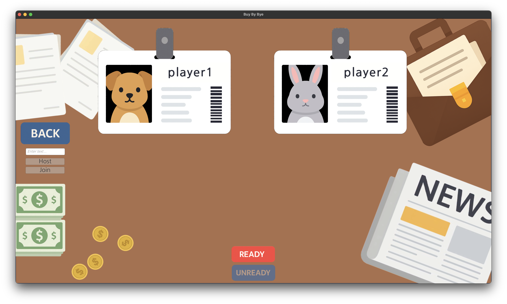
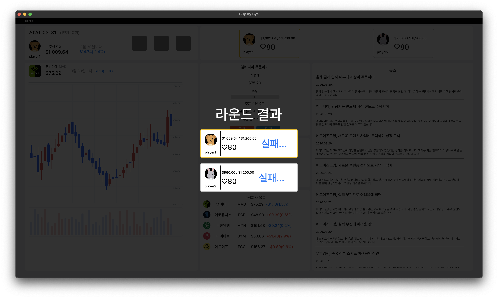
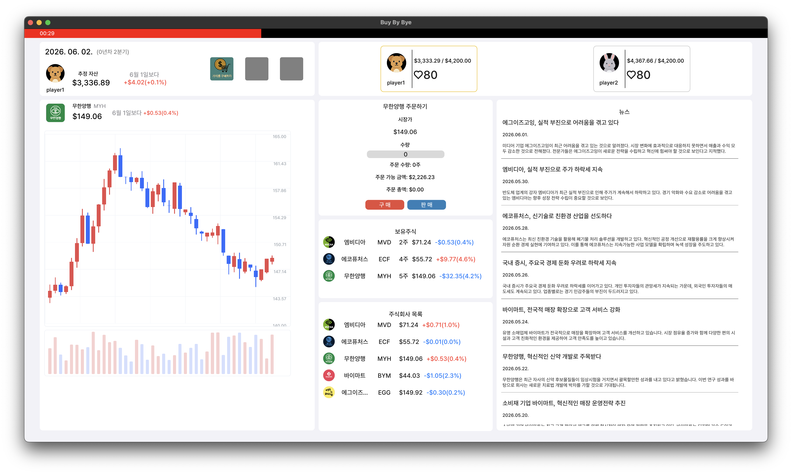
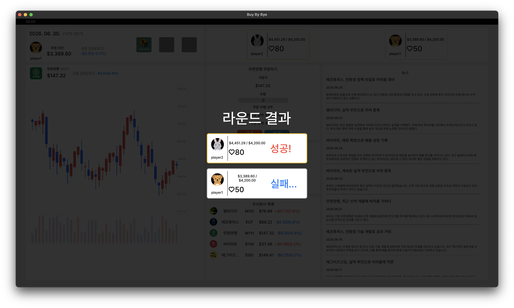
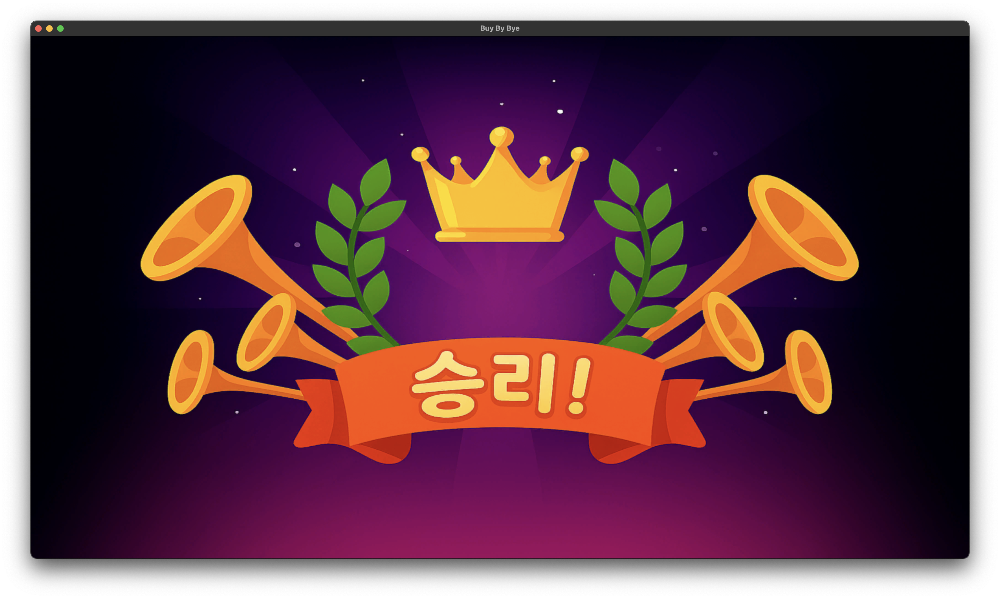

# Bye by Bye


### 가상 주식 시뮬레이션 게임
가상의 펀드매니저가 되어 경쟁자들을 제치고, 최종 승리를 얻자! 

충북대학교 컴퓨터공학과 2025 캡스톤 프로젝트 - 20학번 김완수, 변상준, 이규빈

---

### 작품 개요

게임은 가상의 펀드 매니저가 되어 AI가 생성한 주식 뉴스를 읽고 
실시간으로 변하는 주가를 예측하고 투자하여
분기별 목표 자본금을 달성해 최후의 1인으로 살아남는 것이 목표입니다.

2 - 4명의 플레이어가 동시에 접속하여 AI 뉴스를 분석하며 전략적으로 매매하여 
목표 자본금을 달성해 최후의 1인으로 살아남는 것을 목표로 합니다. 
Unity 엔진과 Mirror 네트워킹을 활용한 게임 시스템과 ChatGPT 기반 뉴스 생성 및 BERT 감성 분석 시스템을 통합하여,
실제 주식 시장과 유사한 환경을 시뮬레이션하는 교육용 게임 플랫폼을 구현하였습니다.

- 경제 뉴스 반영(실시간 트렌드 적용)
- 친구들과 협력하거나 경쟁 가능
- 가상 주식 거래 및 투자
- 현실 경제 개념을 게임화하여 재미와 학습을 동시에 제공

### 게임 시스템

- 게임은 **주식 매매 / 진행 결과 확인 / 아이템 선택** 라운드로 진행됩니다.

- **주식 매매 라운드**: (1분기 당 1라운드)주식 매수, 매도가 가능하며 목표에 도움이 될 수도 있는 뉴스가 지속적으로 등장합니다.
플레이어는 실시간으로 변하는 주가에 맞추어 주식을 매매합니다.
뉴스는 주가에 영향을 주기 때문에 해당 뉴스를 분석하고 주가상승이 예상되는 회사에 투자해야 합니다.

- 게임에 사용된 뉴스는 모두 AI를 사용한 가상 뉴스입니다.
뉴스들은 내용에 따라 회사들에 영향을 줍니다.
<p align="center">
    
    
    
</p>

- **진행 결과 확인 라운드:** 
(라운드 종료 시)플레이어가 주식 매매 라운드에 목표 금액 달성 여부를 확인하는 턴입니다. 
플레이어는 각 라운드마다 목표금액을 달성하지 못하면 체력이 감소합니다.
라운드가 진행될수록 목표금액 및 체력 감소량은 증가하고만약 체력이 0 이하가 된다면 그 플레이어는 탈락합니다.

- **아이템 선택:** (1,2,3라운드 종료 시)플레이어는 도움이 될 아이템을 하나씩, 최대 3개의 아이템을 얻을 수 있습니다.
아이템은 주가, 플레이어 체력 등에 영향을 줍니다.아이템은 주식 명언, 주식 용어를 기반으로 제작되었습니다.
(ex. 달걀을 한 바구니에 담지 마라, 스켈핑, 산타 랠리 등)
<p align="center">
    
    
    
</p>

## 기술 스택

| 기능 | 프레임워크 및 라이브러리, 기술 |
| --- | --- |
| **게임 엔진** | Unity |
| **멀티플레이** | Mirror 에셋 |
| **서버** | AWS EC2 + WebSocket(FastAPI) + Docker |
| **데이터베이스** |  MongoDB |
| **경제 AI (뉴스 생성)** | ChatGPT |
| **시장 예측 AI** | BERT |

### 폴더 구조
```text
├── data_generator/         # 가상 뉴스 데이터 생성 코드
├── game_unity              # unity 게임 코드
├── websocket_server/       # AWS상에서 동작하는 웹소켓 서버 파일
├── readme_asset/           # readme.md용 파일
└── README.md
```

### 스크린샷









